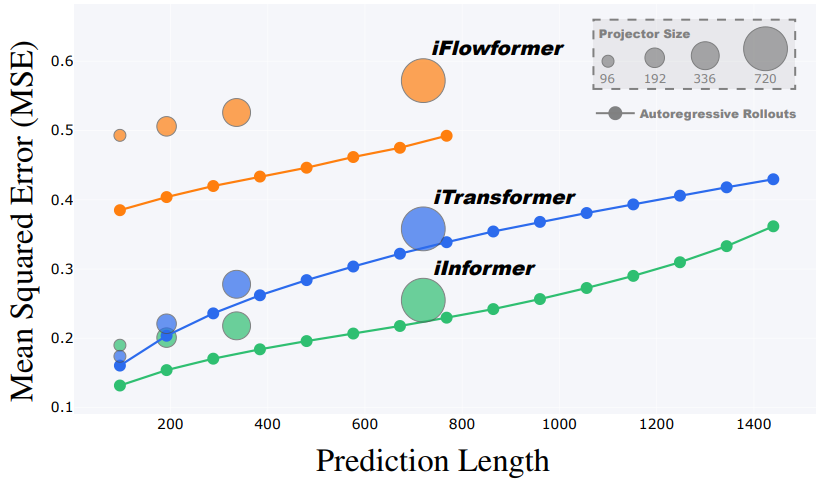
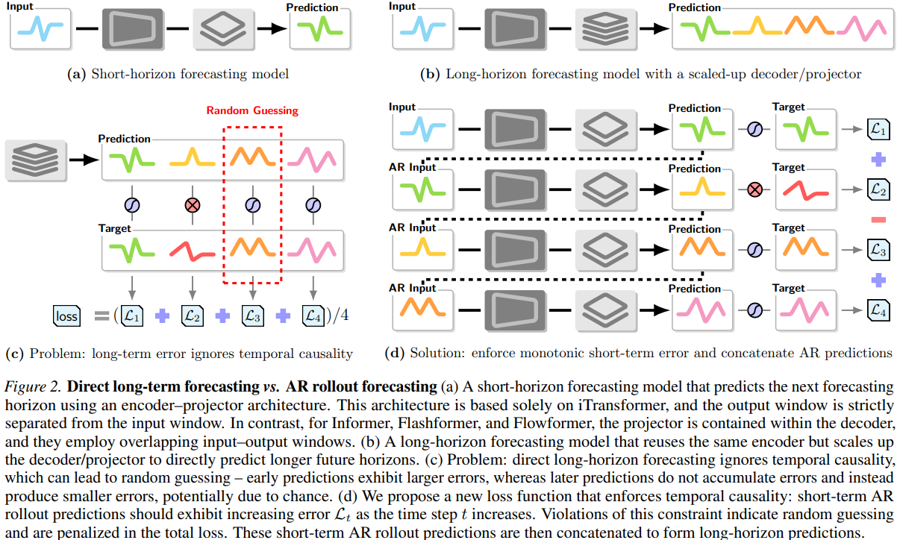

# An Optimization Method for Autoregressive Time Series Forecasting

This repository implements the optimization method described in the paper "An Optimization Method for Autoregressive Time Series Forecasting". The method introduces a novel training approach that enforces temporal causality in time-series forecasting models, enabling flexible long-term predictions via autoregressive (AR) rollouts without scaling model size.

## Abstract

Current time-series forecasting models are primarily based on transformer-style neural networks. These models achieve long-term forecasting mainly by scaling up the model size rather than through genuinely autoregressive (AR) training. From the perspective of large language model training, the traditional training process for time-series forecasting models ignores temporal causality. In this paper, we propose a novel training method for time-series forecasting that enforces two key properties: (1) AR prediction errors should increase with the forecasting horizon. Any violation of this principle is considered random guessing and is explicitly penalized in the loss function, and (2) the method enables models to concatenate short-term AR predictions for forming flexible long-term forecasts. Empirical results demonstrate that our method establishes a new state-of-the-art across multiple benchmarks, achieving an MSE reduction of more than 10% compared to iTransformer and other recent strong baselines. Furthermore, it enables short-horizon forecasting models to perform reliable long-term predictions at horizons over 7.5 times longer.

## Key Features

- **Temporal Causality Enforcement**: Penalizes violations of increasing error in AR rollouts to prevent random guessing.
- **Flexible Forecasting**: Train once on short horizons and use AR rollouts for arbitrary-length predictions.
- **Model-Agnostic**: Integrated with inverted Transformer variants (iTransformer, iInformer, iFlowformer, iFlashformer) without architecture changes.
- **State-of-the-Art Performance**: >10% MSE reduction on benchmarks like Electricity, Traffic, Weather, etc.

## Method Overview

The method uses a novel loss function that incorporates RL-style rewards to enforce temporal monotonicity in prediction errors during AR rollouts. See Algorithm 1 in the paper for details:

- Input: Historical context of length \(S\), rollout stride \(T\), overlap \(L\).
- Generate short-term predictions and concatenate via AR steps.
- Loss: Discounted sum of MSE with penalties for non-increasing errors.

  
*Specialized long-horizon forecasting models (vanilla training) vs. single short-horizon forecasting model (trained with our method and inferred in AR rollout mode).*

  
*Direct long-term forecasting vs. AR rollout forecasting, illustrating the problem and our solution.*

## Results

The method outperforms baselines across multiple datasets. Below is Table 1 from the paper (forecasting performance on Electricity, Traffic, and Weather datasets):

| Task     | Pred. Len. | iTransformer MSE | iTransformer MAE | iInformer MSE | iInformer MAE | iFlowformer MSE | iFlowformer MAE | iFlashformer MSE | iFlashformer MAE |
|----------|------------|------------------|------------------|---------------|---------------|-----------------|-----------------|------------------|------------------|
| ECL_96  | Baseline  | 0.148           | 0.240           | 0.190        | 0.286        | 0.183          | 0.267          | 0.178           | 0.265           |
|         | 96 (AR=1) | 0.141           | 0.239           | 0.131        | 0.232        | 0.141          | 0.241          | 0.142           | 0.241           |
|         | 192 (AR=2)| 0.163           | 0.260           | 0.154        | 0.254        | 0.167          | 0.266          | 0.169           | 0.267           |
|         | 384 (AR=4)| 0.194           | 0.288           | 0.184        | 0.282        | 0.207          | 0.301          | 0.206           | 0.300           |
|         | 768 (AR=8)| 0.238           | 0.324           | 0.229        | 0.320        | 0.263          | 0.345          | 0.257           | 0.340           |
| ECL_192 | Baseline  | 0.162           | 0.253           | 0.201        | 0.297        | 0.192          | 0.277          | 0.189           | 0.276           |
|         | 192 (AR=1)| 0.161           | 0.258           | 0.161        | 0.262        | 0.158          | 0.256          | 0.162           | 0.261           |
|         | 384 (AR=2)| 0.189           | 0.285           | 0.191        | 0.290        | 0.186          | 0.282          | 0.195           | 0.290           |
|         | 768 (AR=4)| 0.230           | 0.318           | 0.230        | 0.322        | 0.223          | 0.312          | 0.239           | 0.325           |
| ECL_336 | Baseline  | 0.178           | 0.269           | 0.218        | 0.315        | 0.210          | 0.295          | 0.207           | 0.294           |
|         | 336 (AR=1)| 0.177           | 0.275           | 0.187        | 0.288        | 0.178          | 0.276          | 0.184           | 0.282           |
|         | 672 (AR=2)| 0.209           | 0.302           | 0.230        | 0.323        | 0.213          | 0.306          | 0.221           | 0.312           |
| ECL_720 | Baseline  | 0.225           | 0.317           | 0.255        | 0.347        | 0.255          | 0.332          | 0.251           | 0.329           |
|         | 720 (AR=1)| 0.207           | 0.300           | 0.203        | 0.296        | 0.210          | 0.303          | 0.222           | 0.314           |
| Traffic_96 | Baseline | 0.395          | 0.268           | 0.632        | 0.367        | 0.493          | 0.339          | 0.464           | 0.320           |
|         | 96 (AR=1) | 0.399           | 0.267           | 0.394        | 0.262        | 0.384          | 0.259          | 0.385           | 0.256           |
|         | 192 (AR=2)| 0.414           | 0.277           | 0.412        | 0.274        | 0.403          | 0.271          | 0.398           | 0.267           |
|         | 384 (AR=4)| 0.440           | 0.298           | 0.442        | 0.297        | 0.433          | 0.293          | 0.419           | 0.283           |
|         | 768 (AR=8)| 0.496           | 0.338           | 0.484        | 0.330        | 0.475          | 0.323          | 0.448           | 0.303           |
| Traffic_192 | Baseline | 0.417          | 0.276           | 0.641        | 0.370        | 0.506          | 0.345          | 0.479           | 0.326           |
|         | 192 (AR=1)| 0.413           | 0.274           | 0.408        | 0.269        | 0.402          | 0.269          | 0.393           | 0.266           |
|         | 384 (AR=2)| 0.436           | 0.290           | 0.433        | 0.285        | 0.426          | 0.285          | 0.411           | 0.278           |
|         | 768 (AR=4)| 0.479           | 0.319           | 0.478        | 0.316        | 0.471          | 0.314          | 0.441           | 0.297           |
| Traffic_336 | Baseline | 0.433          | 0.283           | 0.663        | 0.379        | 0.526          | 0.355          | 0.501           | 0.337           |
|         | 336 (AR=1)| 0.427           | 0.282           | 0.424        | 0.278        | 0.418          | 0.277          | 0.396           | 0.270           |
|         | 672 (AR=2)| 0.463           | 0.304           | 0.462        | 0.302        | 0.456          | 0.300          | 0.421           | 0.285           |
| Traffic_720 | Baseline | 0.467          | 0.302           | 0.713        | 0.405        | 0.572          | 0.381          | 0.524           | 0.350           |
|         | 720 (AR=1)| 0.466           | 0.305           | 0.465        | 0.300        | 0.458          | 0.300          | 0.421           | 0.285           |
| Weather_96 | Baseline | 0.174          | 0.214           | 0.180        | 0.251        | 0.183          | 0.223          | 0.177           | 0.218           |
|         | 96 (AR=1) | 0.160           | 0.210           | 0.147        | 0.201        | 0.161          | 0.211          | 0.162           | 0.212           |
|         | 192 (AR=2)| 0.203           | 0.235           | 0.190        | 0.242        | 0.203          | 0.250          | 0.203           | 0.250           |
|         | 384 (AR=4)| 0.262           | 0.294           | 0.248        | 0.286        | 0.259          | 0.292          | 0.260           | 0.293           |
|         | 768 (AR=8)| 0.338           | 0.342           | 0.322        | 0.333        | 0.333          | 0.339          | 0.333           | 0.310           |
| Weather_192 | Baseline | 0.221          | 0.254           | 0.244        | 0.318        | 0.231          | 0.262          | 0.229           | 0.261           |
|         | 192 (AR=1)| 0.204           | 0.251           | 0.194        | 0.246        | 0.204          | 0.251          | 0.202           | 0.248           |
|         | 384 (AR=2)| 0.261           | 0.295           | 0.251        | 0.290        | 0.261          | 0.294          | 0.259           | 0.292           |
|         | 768 (AR=4)| 0.335           | 0.342           | 0.326        | 0.337        | 0.333          | 0.340          | 0.334           | 0.341           |
| Weather_336 | Baseline | 0.278          | 0.296           | 0.282        | 0.343        | 0.286          | 0.301          | 0.283           | 0.300           |
|         | 336 (AR=1)| 0.251           | 0.286           | 0.246        | 0.286        | 0.249          | 0.285          | 0.250           | 0.287           |
|         | 672 (AR=2)| 0.320           | 0.331           | 0.318        | 0.332        | 0.317          | 0.330          | 0.319           | 0.332           |
| Weather_720 | Baseline | 0.358          | 0.349           | 0.377        | 0.409        | 0.363          | 0.352          | 0.359           | 0.251           |
|         | 720 (AR=1)| 0.329           | 0.337           | 0.326        | 0.338        | 0.325          | 0.335          | 0.328           | 0.337           |

## Getting Started

### Prepare Data
You can obtain the well-preprocessed datasets from [[Google Drive]](https://drive.google.com/drive/folders/13Cg1KYOlzM5C7K8gK8NfC-F3EYxkM3D2?usp=sharing), [[Baidu Drive]](https://pan.baidu.com/s/1r3KhGd0Q9PJIUZdfEYoymg?pwd=i9iy) or [[Hugging Face]](https://huggingface.co/datasets/thuml/Time-Series-Library). Then place the downloaded data in the folder `./dataset`.

Install the Time Series Library (TSLib) 
1. Clone the  TSLib repository.
   ```bash
   git clone https://github.com/thuml/Time-Series-Library.git
   cd Time-Series-Library
   ```

2. Create a new Conda environment.
   ```bash
   conda create -n tslib python=3.11
   conda activate tslib
   ```

3. Install Core Dependencies
   ```bash
   pip install -r requirements.txt
   ```

## Usage Examples

Run experiments on the Weather dataset with various models and prediction lengths:

```bash
# training_k: AR rollout step for model training (how many steps to rollout during training)
# test_k: Max AR rollout step for evaluation and forecasting 
# Multiplies the original prediction length by test_k to extend forecasting horizon

for pred_len in 96 192 336 720
do
    training_k=4
    test_k=$((1500 / ${pred_len}))

    ############################
    # iTransformer / Transformer
    ############################
    python -u run.py \
      --is_training 1 \
      --root_path ./dataset/weather/ \
      --data_path weather.csv \
      --model_id weather_96_${pred_len} \
      --model iTransformer \
      --data custom \
      --features M \
      --pred_len ${pred_len} \
      --enc_in 21 \
      --dec_in 21 \
      --c_out 21 \
      --des 'Exp' \
      --d_model 512 \
      --d_ff 512 \
      --batch_size 512 --training_k ${training_k} --test_k ${test_k} \
      --itr 1

    ######################
    # iInformer / Informer
    ######################
    python -u run.py \
      --is_training 1 \
      --root_path ./dataset/weather/ \
      --data_path weather.csv \
      --model_id weather_96_${pred_len} \
      --model iInformer \
      --data custom \
      --features M \
      --pred_len ${pred_len} \
      --enc_in 21 \
      --dec_in 21 \
      --c_out 21 \
      --des 'Exp' \
      --batch_size 512 --training_k ${training_k} --test_k ${test_k} \
      --itr 1
    
    ##########################
    # iFlowformer / Flowformer
    ##########################
    python -u run.py \
      --is_training 1 \
      --root_path ./dataset/weather/ \
      --data_path weather.csv \
      --model_id weather_96_${pred_len} \
      --model iFlowformer \
      --data custom \
      --features M \
      --pred_len ${pred_len} \
      --enc_in 21 \
      --dec_in 21 \
      --c_out 21 \
      --des 'Exp' \
      --batch_size 512 --training_k ${training_k} --test_k ${test_k} \
      --itr 1

    ############################
    # iFlashformer / Flashformer
    ############################
    python -u run.py \
      --is_training 1 \
      --root_path ./dataset/weather/ \
      --data_path weather.csv \
      --model_id weather_96_${pred_len} \
      --model iFlashformer \
      --data custom \
      --features M \
      --pred_len ${pred_len} \
      --d_layers 1 \
      --factor 3 \
      --enc_in 21 \
      --dec_in 21 \
      --c_out 21 \
      --des 'Exp' \
      --batch_size 512 --training_k ${training_k} --test_k ${test_k} \
      --itr 1
done
```

## License

This project is licensed under the MIT License.